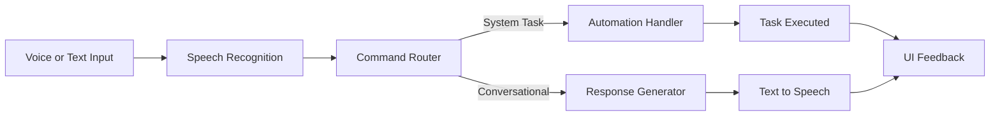
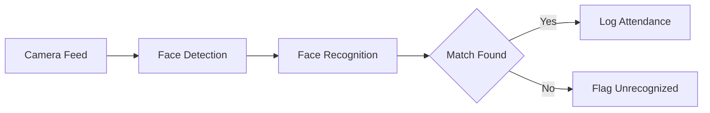

# Abdul Aziz Qureshi

### AI Engineer & Software Developer

**Turning AI models into real, usable systems — desktop assistants, computer vision pipelines, and applied ML tools**

[About](#about) · [Tech Stack](#tech-stack) · [Repository Ecosystem](#repository-ecosystem) · [Featured Projects](#featured-projects) · [Current Focus](#current-focus) · [Connect](#connect)

 

---

## About

I build AI systems that ship as working software, not just notebooks — desktop assistants, computer vision pipelines, and NLP tools designed to run, not just demo.

My GitHub is organized by domain rather than left as a flat list of repos: **AiFusionLab** for ML/DL models, **PyFusion** for Python systems and desktop tools, **CppFusion** for C++ applications, and **ArduinoCore** for embedded and robotics work. Each repo has a defined scope instead of being a dumping ground for scripts.

Currently extending that foundation with backend engineering — **C# / .NET 8** — to build the API layer behind the AI systems I design: moving from *using AI tools* to *engineering the systems that run them*.

 

---

## Tech Stack

**Languages**

**Frameworks & Libraries**

**Tools**

 

**Core Concepts**

`Computer Vision` · `Applied Machine Learning` · `NLP & Transformer Models` · `Desktop Application Architecture` · `REST API Design` · `Embedded Systems`

 

---

## Repository Ecosystem

| Domain | Repository | Focus |
|---|---|---|
| AI / ML Models | [**AiFusionLab**](https://github.com/Azzy-Glitch/AiFusionLab) | Prediction & detection models — regression, classification, NLP |
| Python Systems | [**PyFusion**](https://github.com/Azzy-Glitch/PyFusion) | Desktop assistants, automation tools, Gradio interfaces |
| C++ Systems | [**CppFusion**](https://github.com/Azzy-Glitch/CppFusion) | Structured C++ applications and data-management systems |
| Embedded / Robotics | [**ArduinoCore**](https://github.com/Azzy-Glitch/ArduinoCore) | Sensor- and actuator-driven Arduino systems |

 

---

## Featured Projects

### Nexus — AI Desktop Assistant

`Python` `SpeechRecognition` `pyttsx3` `Tkinter` `Threading` — **License:** MIT

A voice-interactive desktop assistant that routes spoken commands to either system-automation actions or conversational responses, with multi-threaded execution so the interface stays responsive during speech I/O.

Technical notes

- Command routing separates system-level actions from conversational replies instead of handling both in a single path
- Threaded execution keeps the Tkinter interface from blocking during speech recognition and playback
- Part of the <code>PyFusion</code> repository

**Repo:** [PyFusion/Nexus →](https://github.com/Azzy-Glitch/PyFusion/tree/main/Nexus)

 

### Face Attendance System

`Python` `OpenCV`

A real-time face detection and recognition pipeline that automates attendance logging in place of manual tracking.

**Repo:** [PyFusion/FaceAttendance →](https://github.com/Azzy-Glitch/PyFusion/tree/main/FaceAttendance)

 

### AI / ML Model Suite — AiFusionLab

`Python` `TensorFlow` `scikit-learn` `Transformers` `Pandas` — **License:** MIT

A structured collection of ML/DL implementations spanning NLP and classical machine learning. Each model follows a complete pipeline — preprocessing, training, evaluation, and visualization.

- [**BERT News Classifier**](https://github.com/Azzy-Glitch/AiFusionLab/tree/main/BERT%20News%20Classifier) — transformer-based text classification
- [**Auto-Tagging Support Tickets Using LLM**](https://github.com/Azzy-Glitch/AiFusionLab/tree/main/Auto%20Tagging%20Support%20Tickets%20Using%20LLM) — LLM-driven ticket categorization
- **House Price Prediction** / **Heart Disease Classification** — regression and classification with MAE / RMSE / accuracy / precision evaluation
- Select models deployed through **Gradio** interfaces for interactive demos

**Repo:** [AiFusionLab →](https://github.com/Azzy-Glitch/AiFusionLab)

 

---

## Systems and Embedded

**CppFusion** — Structured C++ applications: a **Business Store Management System** and an **Employee Management System**, built with file handling, structs, and modular data management.
**Repo:** [CppFusion →](https://github.com/Azzy-Glitch/CppFusion)

**ArduinoCore** — Sensor- and actuator-driven embedded systems: IR sensors, ultrasonic sensors, motor control, and Bluetooth-integrated modules.
**Repo:** [ArduinoCore →](https://github.com/Azzy-Glitch/ArduinoCore)

 

---

## Current Focus

- Building REST APIs in **C# / .NET 8** — EF Core data access, JWT-based authentication, and dependency-injection patterns — culminating in a capstone E-Commerce API
- Deepening async/await execution, LINQ deferred execution, and DI lifetime management
- Bridging AI models with backend systems to ship full-stack AI products end-to-end, not just standalone models

 

---

## Connect

*Open to discussing AI engineering, backend development, and collaborative projects.*

 

Abdul Aziz Qureshi

